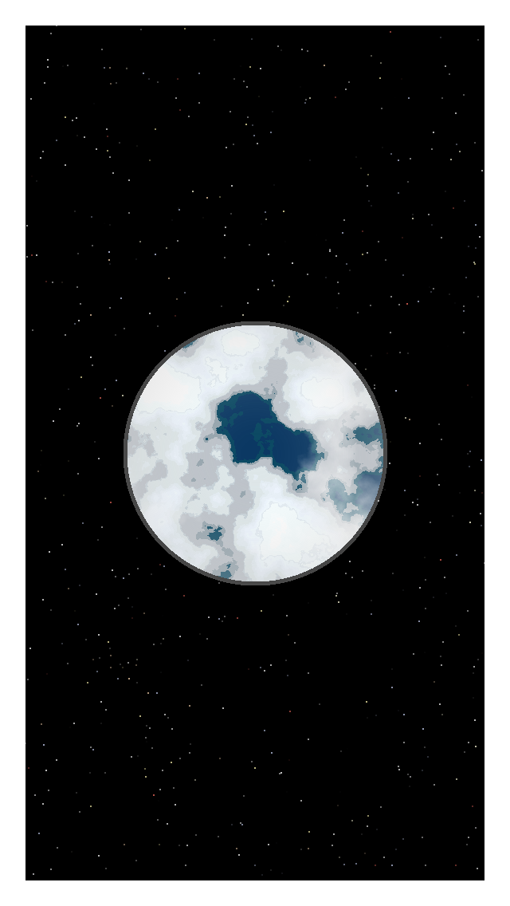
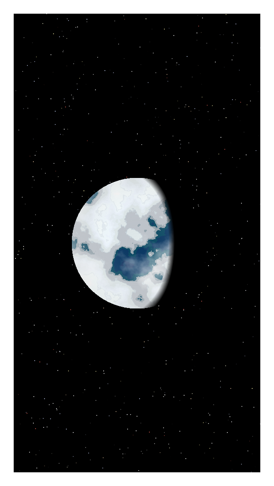
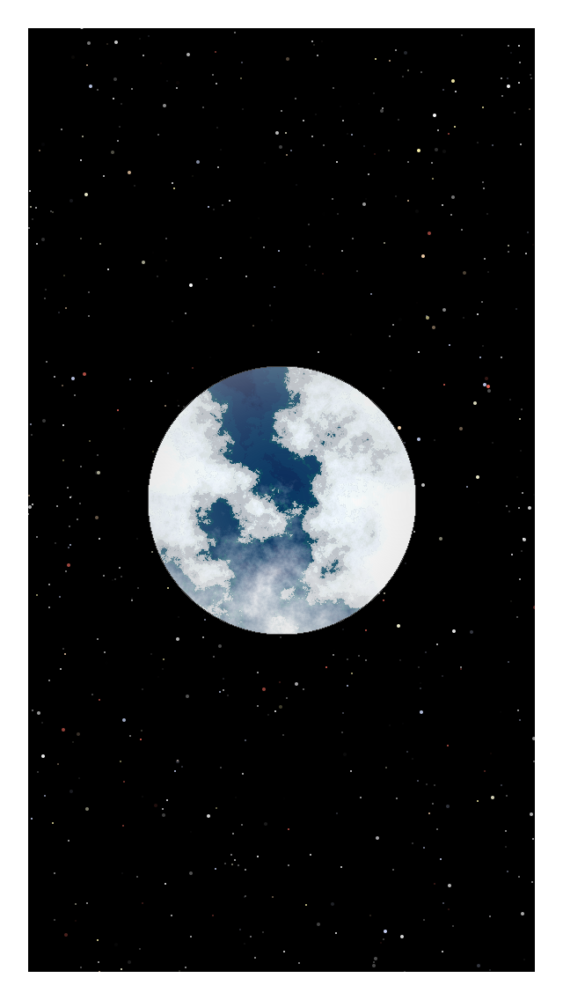
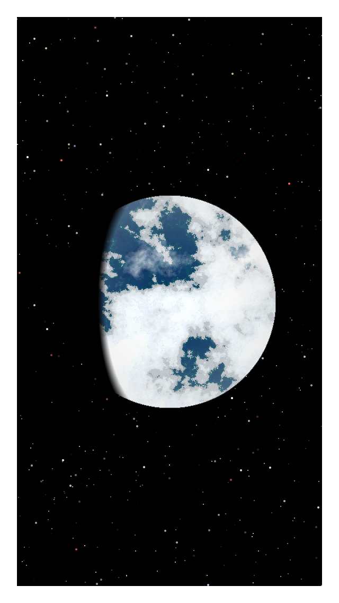
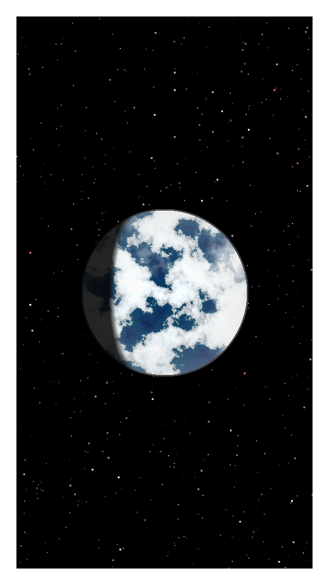
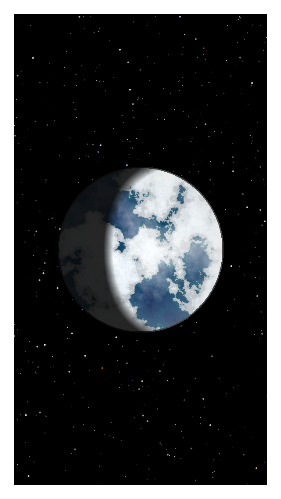

# 'Blue Marbles' - Earth Like World Generator 

This project utilises Perlin noise to generate unique earth like worlds of a random size, inspired by the famous 'Blue Marble' image taken on Apollo 17. [https://en.wikipedia.org/wiki/The_Blue_Marble]

In fact, the project makes use of two Perlin noise generators:
 1) To generate terrain and ice caps. Different noise values are assigned various colours to simulate elevation levels.
 2) To generate planet cloud coverage. 
 
Each generated planet has its own unique landmass and ice caps, along with unique cloud coverage and atmosphere. 

Shadows, simulating the dark side of the earth will appear over the planet with a chance of >= .66 percent. 

## Examples

### With Ice Age Mode Disabled 

### With Ice Age Mode Enabled







## Running The Program

### Prerequisites

Language:
```
Python 3.7 
```

Python Packages: 
```
noise
pycairo
```

### Installing

I have included a 'setup.sh' bash script that sets up the environment and runs the program, outputting a timestamped png image. This will work if running on a Unix based OS. 

The script does the following:
1) Creates a Python virtual environment
2) Activates the environment
3) Upgrades pip
4) Installs required packages to the environment
5) Runs the program, generating a world 

To run clone this project, cd into the root of the cloned folder and run: 
```
sh setup.sh 
```

### Running After Installation 

Activate the created virtual environment 

```
source ./venv/bin/activate
```

Run the main file

```
python main.py
``` 

## Custom Options

#### Custom Image Width & Height
Alter main.py and set custom values for WIDTH and HEIGHT 

#### Switch Border On / Off

By default the image is drawn with a white border to frame the image. 

To disable, alter main.py and set:
```
DRAW_BORDER = False
``` 

## Custom World Options

There are a few options the user can tinker with to customise the generated world.

#### Ice Age Mode 

By default ice age mode is switched off. Enabling ice age mode will generate an earth like planet in the midst of an ice age, with normal terrain replaced by snow and ice. 

To enable, alter main.py and set:
```
ICE_AGE = True
``` 

#### Cloud Opacity 

By default cloud opacity varies by random choice between 1, 2, 3 and 4. 

To increase cloud opacity, alter main.py and set CLOUD_STRENGTH to a static higher value like 4.

To reduce cloud visibility set lower, something like 1 or 2. 

#### Ice Cap Length 

Defaulted to between 0.3 and 1 (inclusive).

To make ice caps more prominent raise the ice cap strength to a static higher value like 1, to reduce, lower the value to say 0.3.

To alter, edit main.py and set ICE_CAP_STRENGTH to your custom value.

#### Atmosphere Thickness 
Defaulted to between 1 and 1.4 (inclusive).

To set a dense and thick atmosphere, set to static higher value like 2.

To set a thin atmosphere set to a low value like 0.5 or 1. 

To alter, edit main.py and set ATMOSPHERE_STRENGTH to your custom value.